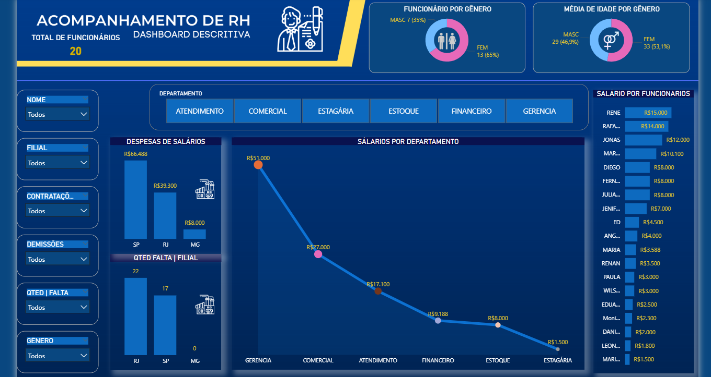
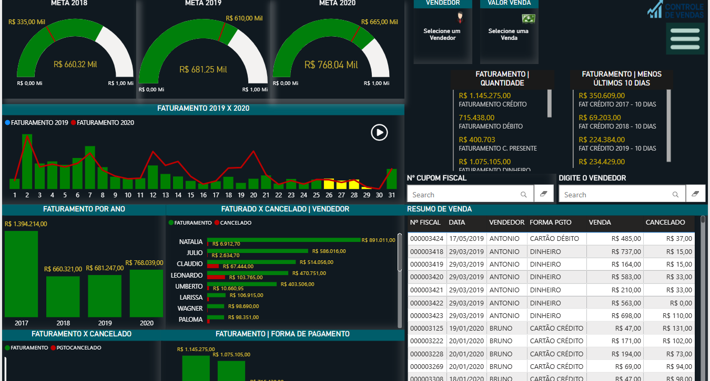
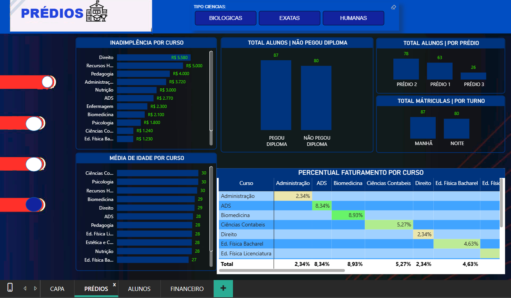

# 📊 Portfólio de Business Intelligence (Power BI)

Bem-vindo ao meu portfólio de análise de dados! Aqui apresento soluções desenvolvidas para transformar dados brutos em inteligência de negócio, utilizando Power BI, DAX e integração com bases de dados.

---

## 📈 1. Dashboard de Acompanhamento de RH
**Foco:** Gestão de Capital Humano e Indicadores de Folha.
- **Destaques:** Análise de despesas salariais por filial (SP, RJ, MG), distribuição por gênero e média de idade. 
- **Insights:** Visualização clara de faltas por filial e ranking de salários por departamento, facilitando a identificação de custos operacionais.

---

## 🚗 2. Gestão de Locação - Frota Peugeot 
**Foco:** Logística e Faturamento de Serviços. 
- **Destaques:** Controle de quilometragem média, faturamento total e status de veículos (Ativo/Inativo). 
- **Insights:** Ranking de faturamento por dia da semana e consulta rápida de placas, ideal para automação de processos logísticos. 

---

## 🛍️ 3. Controle de Vendas e Metas
**Foco:** Performance Comercial e Faturamento.
- **Destaques:** Acompanhamento de metas anuais (2018-2020) com indicadores tipo "velocímetro", faturamento por vendedor e análise de cancelamentos.
- **Insights:** Comparativo histórico (2019 x 2020) e detalhamento de vendas por forma de pagamento e cupom fiscal.

---

## 🎓 4. Gestão Acadêmica - Faculdade São Lourenço
**Foco:** Monitoramento de Inadimplência e Matrículas.
- **Destaques:** Indicadores de inadimplência por curso, total de alunos por prédio e análise de entrega de diplomas.
- **Insights:** Percentual de faturamento por curso e perfil demográfico dos alunos, voltado para a gestão estratégica da instituição.

---

### 🛠️ Competências Técnicas Demonstradas:
- **Modelagem de Dados:** Estruturação de dados provenientes de planilhas Excel (limpeza e tratamento).
- **DAX Avançado:** Criação de medidas para cálculo de metas, faturamento acumulado e médias dinâmicas.
- **Visualização de Dados:** Design de Dashboards intuitivos com filtros segmentados por data, categoria e status.
- **ETL (Power Query):** Tratamento e transformação de dados brutos para relatórios precisos.

---
**📍 João Pedro Faria** *Graduando em ADS - Centro Universitário São Lourenço* [LinkedIn](https://www.linkedin.com/in/joaopedronevesfaria)
